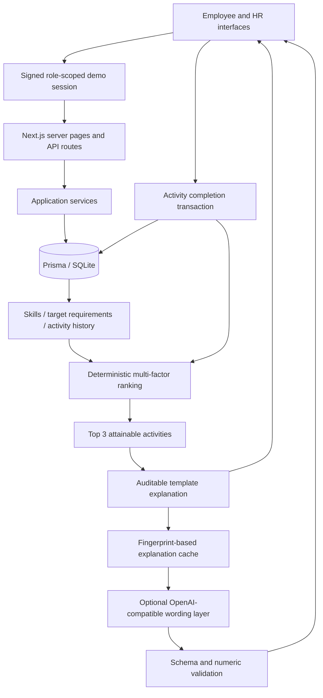
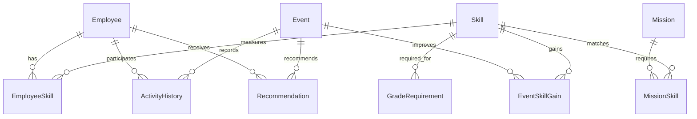

# Halyk TalentOS — Career Quest

An explainable internal career navigator for the **HackAlem AI hackathon, Halyk Bank track**. Employees see where they are, the requirements for their next role, and the activity with the greatest expected career impact. HR sees workforce capability gaps and development opportunities.

Built with **Next.js 16 / App Router, TypeScript, Tailwind CSS 4, shadcn-style Radix UI primitives, Prisma + SQLite, Recharts, Lucide and Framer Motion**. All bundled people and histories are synthetic. No API key is needed for the demo.

## Why this exists

A course catalog cannot answer “what should I do next, and why?” TalentOS connects current skills, grade requirements, career targets, attainable activity outcomes and participation history. A lower skill is not automatically a higher priority. Recommendations describe a measurable before/after development impact, rather than promising a promotion.

## Quick start

Requires Node.js 22.12+ (Node.js 24 recommended) and npm.

```bash
npm ci
npm run db:setup
npm run dev
```

Open [http://127.0.0.1:3000](http://127.0.0.1:3000).

The setup script creates a local `.env`, generates a random session secret, initializes SQLite, applies the committed migration and seeds data. Re-running setup preserves existing employees and completed activities.

For a production-mode local preview:

```bash
npm run build
npm start
```

This full-stack app requires a Node server and durable SQLite storage. It is not a static export. Run one application instance with this SQLite configuration; migrate to PostgreSQL and a real identity provider before a multi-instance production deployment.

## Demo accounts

| Button        | Session                                  | Starting view             |
| ------------- | ---------------------------------------- | ------------------------- |
| Employee demo | Aidar Sarsenov · Middle Backend Engineer | Personal career dashboard |
| HR demo       | People & Culture                         | Workforce control tower   |

The sidebar switches between these synthetic demo roles. Signing out clears the HTTP-only session cookie. Mock login is intentionally enabled only when `DEMO_LOGIN_ENABLED=true`; it is not enterprise authentication.

Seed: **48 employees, 24 skills, 20 activities, 2 internal missions and six months of history**. The model and import pipeline accept larger datasets and arbitrary employee identifiers.

## Two-minute hackathon demo

1. Open Employee demo. Aidar has 52 months of experience and **68%** readiness for Senior Backend Engineer.
2. Open My skills. Public Speaking is only **1/5**, while System Design is **2/5**.
3. Return to Dashboard and select **Why this activity?** for Advanced System Design Workshop.
4. Inspect the grade requirements, expected gains, history evidence and expandable scoring breakdown.
5. Open **Why not Public Speaking?**: speaking is not a Senior Backend requirement, and three similar communication activities were skipped.
6. Select **Mark as completed**. System Design changes **2 → 3** and readiness changes **68% → 76%**. A new top recommendation appears.
7. Switch to HR. Inspect the skill gaps, participation chart and private talent map.
8. Run a workforce scenario for 50 additional Applied AI-skilled employees over nine months.
9. Open Import data, download the sample profile and import it. Open the new profile from the success result and inspect its computed recommendation.
10. Import the full sample dataset to demonstrate a completely new skill, role, activity and employee.

Completion persists across refreshes and restarts. To replay the demo from a fresh state, use a separate empty SQLite database and run setup; do not reset a database containing evaluation imports.

## Architecture



- `lib/recommendation-engine.ts`: pure ranking, readiness and skill-gain functions.
- `lib/services.ts`: catalog, employee snapshots, atomic completion and workforce aggregation.
- `lib/ai-explanation-service.ts`: optional model wording, validation and persistent cache.
- `lib/import-service.ts`: JSON/CSV parsing, schema validation, foreign-key checks and transactional imports.
- `lib/scenario-engine.ts`: disjoint planning cohorts.
- `lib/auth.ts`: HMAC sessions and server-side role protection.
- `app/api/[...path]/route.ts`: role-scoped HTTP boundary; employee IDs come from the session.
- `prisma/schema.prisma`, `prisma/migrations/`, `prisma/seed.ts`: durable model and repeatable setup.
- `components/`: responsive workspaces and shared UI primitives.

## Recommendation algorithm

The algorithm is deterministic/hybrid. **The LLM does not decide rankings, invent skill levels, or write employee records.**

```text
score =
  0.30 × critical_skill_gap
+ 0.20 × next_grade_relevance
+ 0.15 × completion_probability
+ 0.10 × career_goal_alignment
+ 0.10 × activity_skill_gain
+ 0.10 × business_priority
+ 0.05 × diversity_bonus
- skip_penalty
```

All factors and the final score are clamped to [0, 1].

| Factor                 | Evidence                                                                                                             |
| ---------------------- | -------------------------------------------------------------------------------------------------------------------- |
| Critical skill gap     | Relative missing proficiency, scaled by the competency's promotion weight                                            |
| Next-grade relevance   | Target requirement weights addressed by attainable gains                                                             |
| Completion probability | Smoothed completion rate for similar categories/skills, plus tenure and exposure in the current role/grade framework |
| Career goal alignment  | Fraction of activity gains that close a selected target requirement                                                  |
| Activity skill gain    | Expected readiness increase, normalized against 15 percentage points                                                 |
| Business priority      | Configured activity priority                                                                                         |
| Diversity              | Smaller bonus when similar activities were already attempted                                                         |
| Skip penalty           | Similar skips, declines and a prior skip of this particular activity                                                 |

Completed and declined activities are excluded; minimum tenure is enforced. An activity must improve target readiness and at least one skill to be recommended. At an activity's proficiency ceiling it offers no further gain. Missing target requirements return an explicit empty state. Ties resolve by effort and stable activity ID.

A recommendation includes its score, every factor, each projected skill change, before/after readiness, a template explanation and a concrete alternative comparison.

### Readiness: actual calculations

```text
readiness = round(100 × Σ(weight × min(current / required, 1)) / Σ(weight))
new_level = max(current, min(current + gain, activity.maxLevel, 5))
```

The Senior Backend framework includes Python (14%), Databases (14%), System Design (32%), Leadership (24%) and Cloud (16%). Aidar's levels are 4/4, 4/4, 2/4, 2/3 and 2/4 respectively:

```text
Before: 14 + 14 + 16 + 16 + 8 = 68%
After System Design 2 → 3: 14 + 14 + 24 + 16 + 8 = 76%
```

These figures are derived by the same function used for new imported profiles. There is no employee-specific ranking rule. Promotion remains a human decision.

## Explainability and AI usage

Without an API key, the app provides evidence-based templates immediately. With a key, the explanation service sends only role, grade, target, skill gaps, aggregated history statistics, activity information and ranking factors. Names, employee IDs and raw engagement histories are not sent.

The provider must return JSON containing `summary`, `reasons`, `impact` and `why_not_alternative`. Zod checks shape and bounds. Numeric claims absent from the canonical evidence cause a fallback; the impact sentence always comes from the deterministic calculation. A five-second timeout, provider failure or invalid response also uses the template. Ranking and data mutation never depend on the model.

Explanations are requested only when a detail view opens and cached in SQLite for up to 24 hours by an evidence/provider fingerprint. Skill or target changes invalidate caches. A numeric allowlist is a guardrail, not semantic verification of every natural-language claim; evidence cards and the canonical score remain authoritative. No live provider call is required for evaluation.

Evidence confidence is an explicitly labeled demo heuristic: 35% baseline + 15% per relevant completed activity, capped at 95%. It is not a validated proficiency assessment. No on-time completion percentage is fabricated because this dataset has no due-date fields.

## Data model



History statuses: `COMPLETED`, `SKIPPED`, `DECLINED`, `IN_PROGRESS`. Each employee/event pair has one lifecycle record. Completion is idempotent and skill updates, history writes and cache invalidation share a transaction.

## Evaluation dataset import

Use **HR → Import data**. Upload up to 5 JSON/CSV files, 2 MB per file and 8 MB total. Files are validated together and written atomically. Existing IDs are upserted, making a repeated import safe. Employee skill arrays replace that employee's current skill snapshot; event gain arrays replace the event's configured gains.

Supported files:

- `employees.json`: array of profiles (or a single profile object).
- `skills.json`: array of skill definitions.
- `events.json`: array of activities and gains.
- `activity_history.csv`: header-based participation records.
- `requirements.json`: optional framework for a new target role.
- A combined JSON object with `employees`, `skills`, `events`, `history` and/or `requirements` arrays can replace separate JSON files.

Samples are in [public/samples](public/samples) and downloadable in the import screen.

### Employee

```json
{
  "id": "JUDGE_NEW_01",
  "employeeId": "EXT-01",
  "name": "Synthetic Evaluation Profile",
  "role": "Backend Engineer",
  "grade": "Middle",
  "department": "Engineering",
  "tenureMonths": 36,
  "targetRole": "Backend Engineer",
  "targetGrade": "Senior",
  "skills": [
    { "skillId": "SK_SYSTEM_DESIGN", "level": 2 },
    { "skillId": "SK_PYTHON", "level": 4 }
  ]
}
```

Missing skills count as level zero. Levels are integers 0–5. IDs contain letters, numbers, underscores or hyphens. `department` defaults to “Imported team”. The recommendation engine works with any employee ID.

### Skill, activity and requirement

```json
{
  "skills": [
    {
      "id": "SK_NEW",
      "skillCode": "SK_NEW",
      "name": "New Competency",
      "category": "Technical"
    }
  ],
  "events": [
    {
      "id": "EV_NEW",
      "eventCode": "EV_NEW",
      "name": "New Competency Lab",
      "type": "Workshop",
      "category": "Engineering",
      "description": "Guided practical work",
      "hours": 6,
      "businessPriority": 0.9,
      "minTenureMonths": 0,
      "gains": [{ "skillId": "SK_NEW", "gain": 1, "maxLevel": 4 }]
    }
  ],
  "requirements": [
    {
      "role": "New Role",
      "grade": "Senior",
      "skillId": "SK_NEW",
      "requiredLevel": 4,
      "weight": 1
    }
  ]
}
```

Skill categories are `Technical`, `People` or `Business`. Gain and maxLevel are integers 1–5. Business priority is 0–1; requirement weight is positive and at most 1. Relative weights are normalized at calculation time.

### History CSV

```csv
employeeId,eventId,status,createdAt,completedAt
JUDGE_NEW_01,EV017,IN_PROGRESS,2026-09-01T09:00:00Z,
JUDGE_NEW_01,EV006,COMPLETED,2026-08-01T09:00:00Z,2026-08-02T09:00:00Z
```

`employeeId` in history refers to the Employee `id`, not its external `employeeId` field. Dates use ISO 8601 with a timezone. Completed records require `completedAt` on or after `createdAt`. Referenced employees, events and skills must exist already or arrive in the same upload.

Imported levels are the source of truth: historical completions do not replay skill gains. New completions through the application do apply configured gains. Undefined career targets produce zero recommendations and a review state until requirements are imported.

## Privacy and access control

- Employee server pages and APIs resolve identity from a signed, expiring HTTP-only cookie.
- Employee queries cannot select another person's history through a supplied ID.
- HR-only routes protect workforce analytics, employee profiles and uploads.
- State-changing requests require a matching Origin header; cookies use SameSite Strict and Secure on HTTPS.
- LLM credentials stay on the server; data sent for wording excludes names and IDs.
- Engagement is private; there are no employee leaderboards.
- Development data and secrets are ignored by Git.
- Demo role switching is deliberately not a security boundary against demo participants. Disable mock login and implement corporate SSO, audited grants and retention policies before using actual employee information.

## Environment variables

| Variable             | Purpose                                                             |
| -------------------- | ------------------------------------------------------------------- |
| `DATABASE_URL`       | SQLite URL, default `file:./dev.db` relative to Prisma schema       |
| `SESSION_SECRET`     | At least 32 characters; setup generates a random value              |
| `DEMO_LOGIN_ENABLED` | `true` enables the two demo roles                                   |
| `LLM_API_KEY`        | Optional server-only provider key                                   |
| `LLM_BASE_URL`       | OpenAI-compatible base URL; defaults to `https://api.openai.com/v1` |
| `LLM_MODEL`          | Optional model name; defaults to `gpt-4.1-mini`                     |

Keep `.env` private. Share `.env.example`, never real credentials.

## Tests and verification

```bash
npm run typecheck
npm test
npm run build
```

Tests cover the tricky lowest-skill counterexample, weighted target requirements, history evidence, skip/decline penalties, eligibility, attainable gains, ceilings, updated readiness, recalculation, unknown employee IDs, malformed imports, CSV history, scenario cohort accounting and signed sessions. The performance test measures a 40-event candidate set against the 500 ms engine target. Application latency also depends on hosting, database size and an optional model provider; no blanket latency guarantee is claimed.

The CI workflow installs locked dependencies, initializes a fresh database, type-checks, tests and builds.

## Workforce planning assumptions

The simulator demonstrates the future strategic planning module using explicit heuristics: level 4+ is ready now, level 3 may be upskilled in three months, level 2 in six months, and engaged level-1 employees may be mobility candidates after nine months. Cohorts are mutually exclusive and limited to the requested **additional** headcount. Existing talent is reported separately. Capacity, employee interest and training efficacy are not modeled.

## Roadmap

1. **Career Quest** — explainable recommendations and individual development.
2. **Internal Missions** — apply skills to real cross-functional initiatives.
3. **Talent Marketplace** — match people, teams and opportunities with consent.
4. **Strategic Workforce Planning** — validated capacity and reskilling scenarios.
5. **TalentOS** — the intelligence layer for internal allocation, reskilling and talent mobility.

Next production steps: enterprise SSO, PostgreSQL, immutable evidence/event audit logs, manager-validated assessments, calibrated readiness models, import previews/versioning, accessibility audits, observability and a privacy-reviewed talent marketplace.
